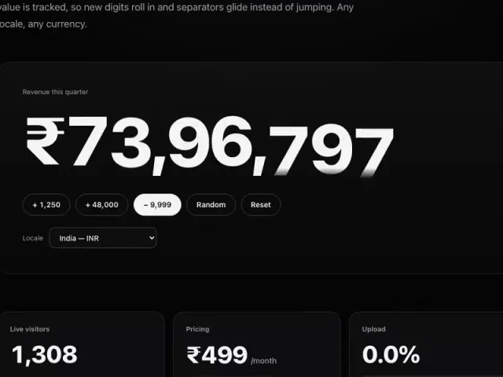
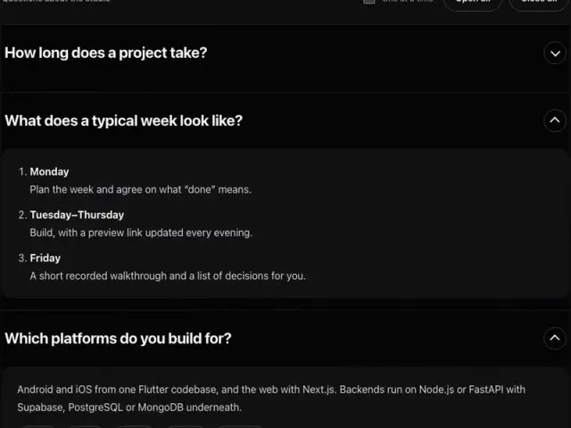
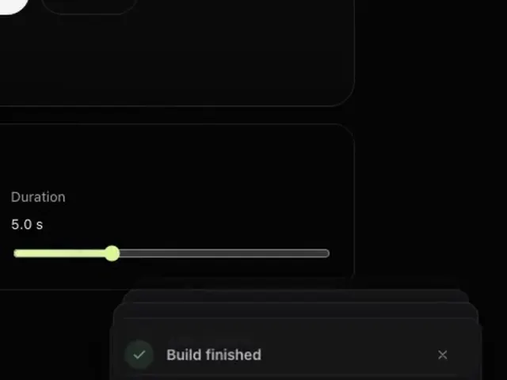
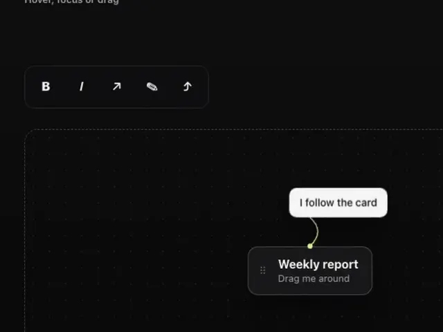
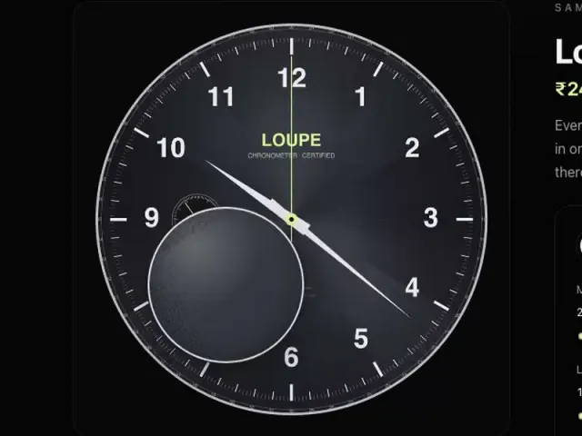
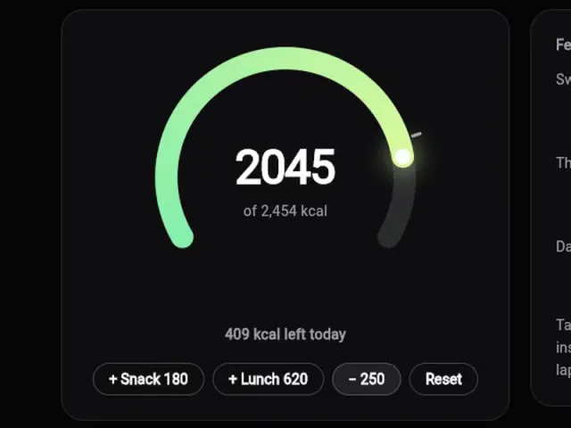
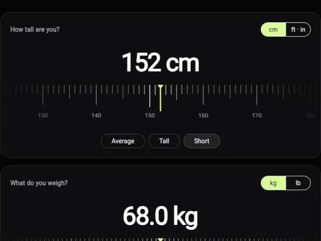
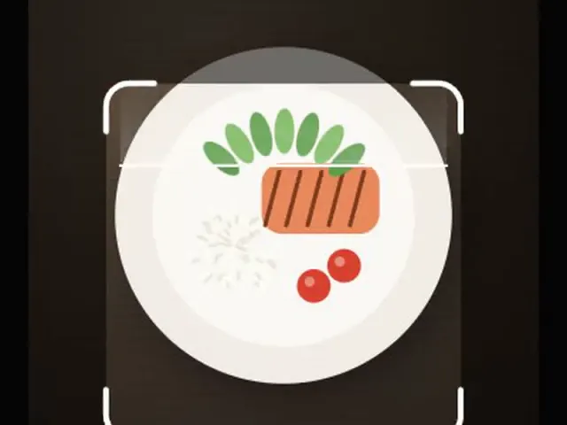
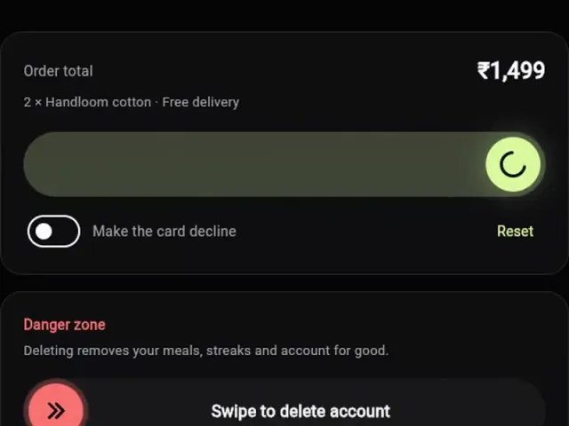
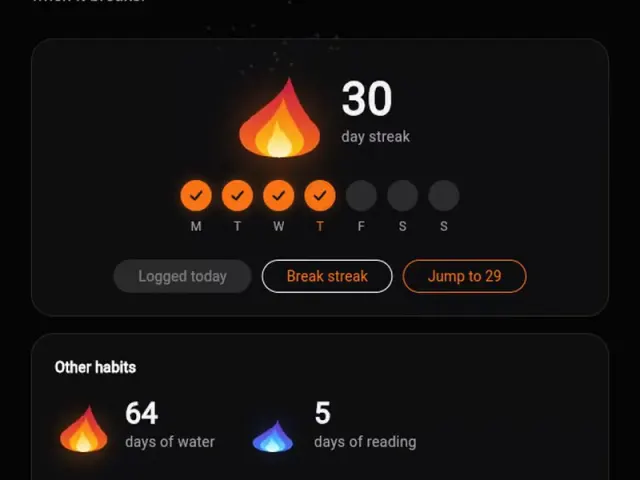

  
  
  

### Hey, I'm Yagnik.

A mobile & full-stack developer in Rajkot, India, with **3+ years** of experience and **19+ Android and iOS apps** delivered. I build products end to end — polished interfaces, APIs and databases — with **Flutter**, **Next.js**, **Node.js**, **Supabase** and **MongoDB**.

- 📱 Cross-platform apps in Flutter, from onboarding and OTP login to camera and AI features
- 🖥️ SaaS dashboards and motion-led websites in Next.js
- ⚙️ REST APIs with Node.js, Express and FastAPI on Supabase, PostgreSQL and MongoDB
- 🧩 Now: open-sourcing the interface parts I keep rebuilding — [10 so far](#open-source-components)

## Open-source components

Free, MIT-licensed and dependency-free. Each has a live demo, keyboard and screen reader support, and respects reduced motion. **[Browse them all →](https://www.yagnikbarasiya.com/components)**

<table>
  <tr>
    <td width="50%" valign="top">
      
       <b><a href="https://github.com/YagnikBarasiya23/tally-rolling-number">Tally</a></b> · Rolling number counter
       Web · <a href="https://yagnikbarasiya23.github.io/tally-rolling-number/">Live demo</a> · <a href="https://www.yagnikbarasiya.com/components/tally-rolling-number">Docs</a>
    </td>
    <td width="50%" valign="top">
      
       <b><a href="https://github.com/YagnikBarasiya23/fold-accordion">Fold</a></b> · Paper-fold accordion
       Web · <a href="https://yagnikbarasiya23.github.io/fold-accordion/">Live demo</a> · <a href="https://www.yagnikbarasiya.com/components/fold-accordion">Docs</a>
    </td>
  </tr>
  <tr>
    <td width="50%" valign="top">
      
       <b><a href="https://github.com/YagnikBarasiya23/deck-toast-stack">Deck</a></b> · Toast stack
       Web · <a href="https://yagnikbarasiya23.github.io/deck-toast-stack/">Live demo</a> · <a href="https://www.yagnikbarasiya.com/components/deck-toast-stack">Docs</a>
    </td>
    <td width="50%" valign="top">
      
       <b><a href="https://github.com/YagnikBarasiya23/tether-tooltip">Tether</a></b> · Elastic tooltip
       Web · <a href="https://yagnikbarasiya23.github.io/tether-tooltip/">Live demo</a> · <a href="https://www.yagnikbarasiya.com/components/tether-tooltip">Docs</a>
    </td>
  </tr>
  <tr>
    <td width="50%" valign="top">
      
       <b><a href="https://github.com/YagnikBarasiya23/loupe-image-zoom">Loupe</a></b> · Product image zoom
       Web · <a href="https://yagnikbarasiya23.github.io/loupe-image-zoom/">Live demo</a> · <a href="https://www.yagnikbarasiya.com/components/loupe-image-zoom">Docs</a>
    </td>
    <td width="50%" valign="top">
      
       <b><a href="https://github.com/YagnikBarasiya23/arcline">Arcline</a></b> · Arc gauge
       Flutter · <a href="https://yagnikbarasiya23.github.io/arcline/">Live demo</a> · <a href="https://www.yagnikbarasiya.com/components/arcline">Docs</a>
    </td>
  </tr>
  <tr>
    <td width="50%" valign="top">
      
       <b><a href="https://github.com/YagnikBarasiya23/notch_ruler_picker">Notch</a></b> · Ruler picker
       Flutter · <a href="https://yagnikbarasiya23.github.io/notch_ruler_picker/">Live demo</a> · <a href="https://www.yagnikbarasiya.com/components/notch_ruler_picker">Docs</a>
    </td>
    <td width="50%" valign="top">
      
       <b><a href="https://github.com/YagnikBarasiya23/viewfinder_scan_frame">Viewfinder</a></b> · Camera scan frame
       Flutter · <a href="https://yagnikbarasiya23.github.io/viewfinder_scan_frame/">Live demo</a> · <a href="https://www.yagnikbarasiya.com/components/viewfinder_scan_frame">Docs</a>
    </td>
  </tr>
  <tr>
    <td width="50%" valign="top">
      
       <b><a href="https://github.com/YagnikBarasiya23/latch_swipe_confirm">Latch</a></b> · Swipe to confirm
       Flutter · <a href="https://yagnikbarasiya23.github.io/latch_swipe_confirm/">Live demo</a> · <a href="https://www.yagnikbarasiya.com/components/latch_swipe_confirm">Docs</a>
    </td>
    <td width="50%" valign="top">
      
       <b><a href="https://github.com/YagnikBarasiya23/ember_streak">Ember</a></b> · Streak counter
       Flutter · <a href="https://yagnikbarasiya23.github.io/ember_streak/">Live demo</a> · <a href="https://www.yagnikbarasiya.com/components/ember_streak">Docs</a>
    </td>
  </tr>
</table>

## Selected work

<table>
  <tr>
    <td width="33%" valign="top">
      
       <b><a href="https://www.yagnikbarasiya.com/work/postspop">PostsPop</a></b>
       AI marketing platform
      
A short business brief becomes a seven-day social plan with approvals, a content calendar and an AI caption editor.

      <code>Next.js · FastAPI · Supabase · Gemini</code>
    </td>
    <td width="33%" valign="top">
      
       <b><a href="https://www.yagnikbarasiya.com/work/macrolens">MacroLens</a></b>
       AI calorie tracker · Flutter app + admin
      
Photograph a meal for an editable macro estimate, track the day against targets, and see trends.

      <code>Flutter · Node.js · Supabase · Next.js</code>
    </td>
    <td width="33%" valign="top">
      
       <b><a href="https://www.yagnikbarasiya.com/work/fifteen-flowers">Fifteen Flowers</a></b>
       Motion-led catalogue site
      
Twenty-five handmade products, ordering through Instagram and WhatsApp, GSAP scroll motion and full SEO.

      <code>Next.js · GSAP · Lenis</code>
    </td>
  </tr>
</table>

## Stack

   
  

## Let's work together

I take on freelance projects, contract roles and collaborations — mobile apps and full-stack products in particular. The quickest way to reach me is [WhatsApp](https://wa.me/917048809875) or [email](mailto:yagnikbarasiya2306@gmail.com).
